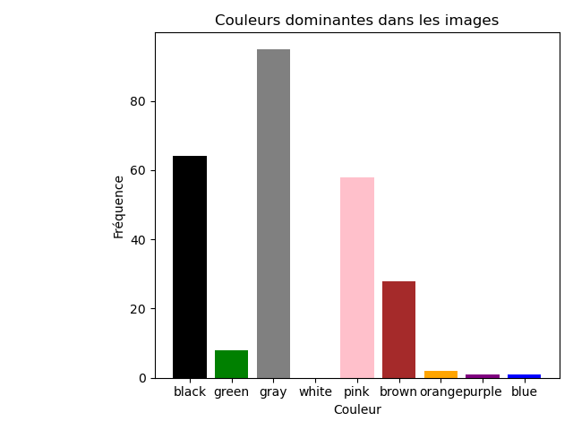

# Système de Recommandation d'Images



## 📌 Description
Un système de recommandation d'images basé sur :
- **Filtrage par contenu** (couleurs, tags, métadonnées)
- **Filtrage collaboratif** (similarité entre utilisateurs)
- Données issues de l'API Picsum Photos

## 🛠️ Structure du projet

```
├── Victoire_Projet2_Big_Data.ipynb # Notebook principal
├── images_metadonnees.json # Métadonnées des images
├── profils_utilisateurs.json # Préférences utilisateurs
├── historique_images.json # Interactions utilisateurs
├── graphes/ # Visualisations globales
│ ├── couleurs_dominantes.png
│ ├── orientations.png
│ └── ...
├── graphes_profils/ # Analyses par utilisateur
│ ├── profil_user_1_couleurs.png
│ └── ...
└── .gitignore
├── README.md # Documentation du projet


## 🔧 Installation
1. Cloner le dépôt :
```bash
git clone [URL_DU_PROJET]

2. Installer les dépendances :
```bash
pip install -r requirements.txt
```
3. Lancer le notebook :
```bash
jupyter notebook Victoire_Projet2_Big_Data.ipynb
```
## 📊 Visualisations

```bash
# Visualiser les graphes    
jupyter nbconvert --to html Victoire_Projet2_Big_Data.ipynb
```
## 📄 Licence
Projet académique - Libre de réutilisation (API Picsum Photos sous license CC0)

## 📧 Contact
Pour toute question ou suggestion, veuillez contacter [victorykasende@gmail.com](mailto:victory.kasende@gmail.com).
